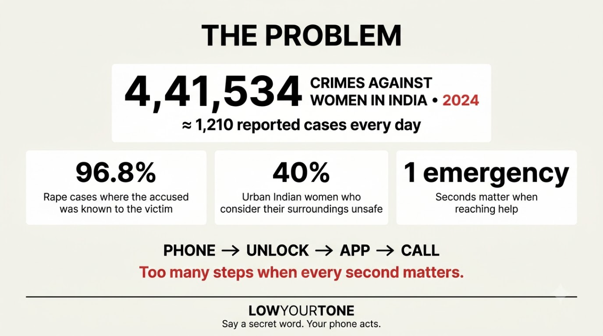
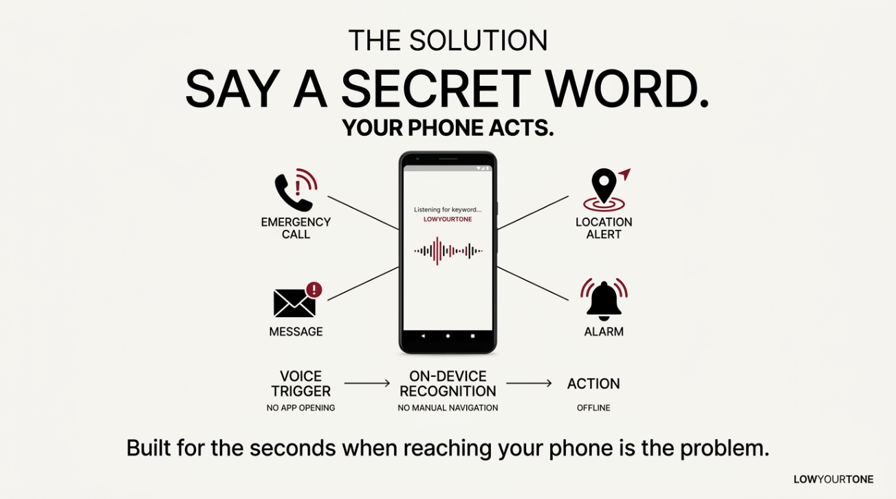
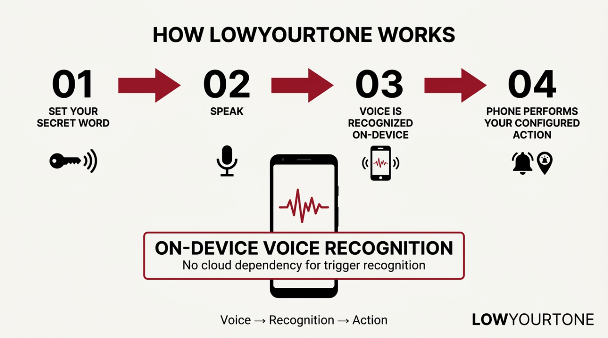
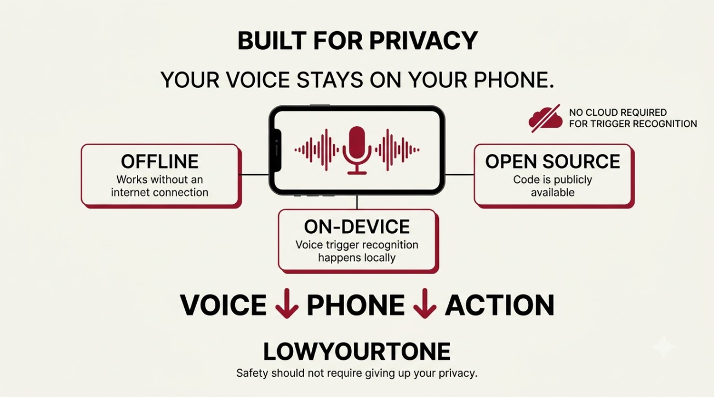
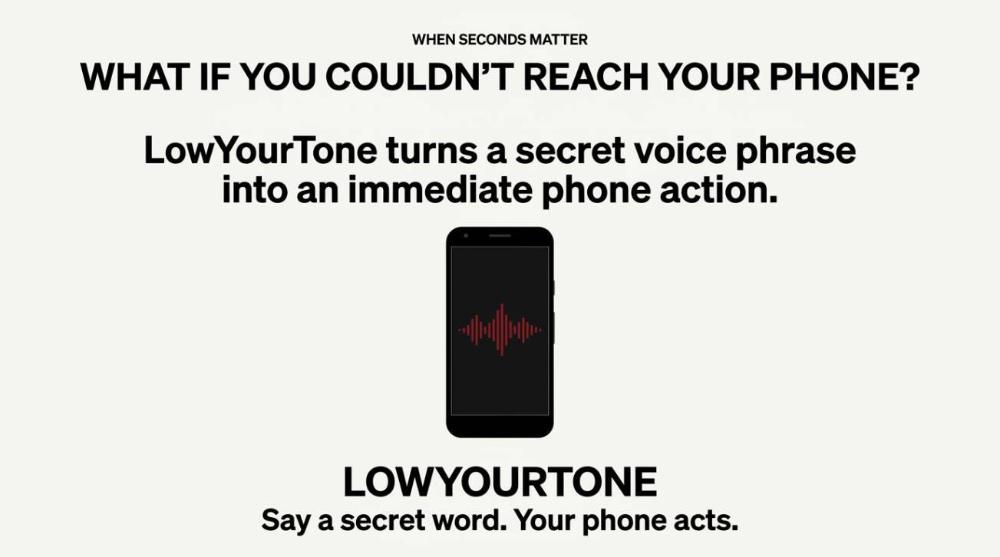
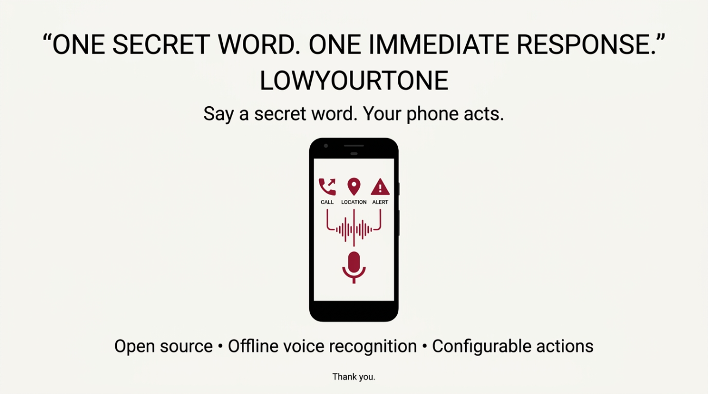
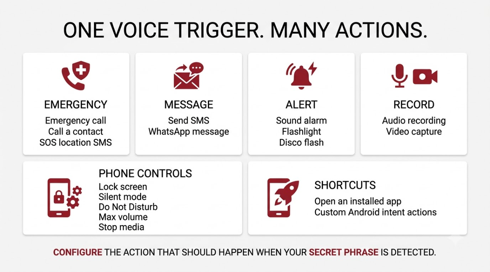
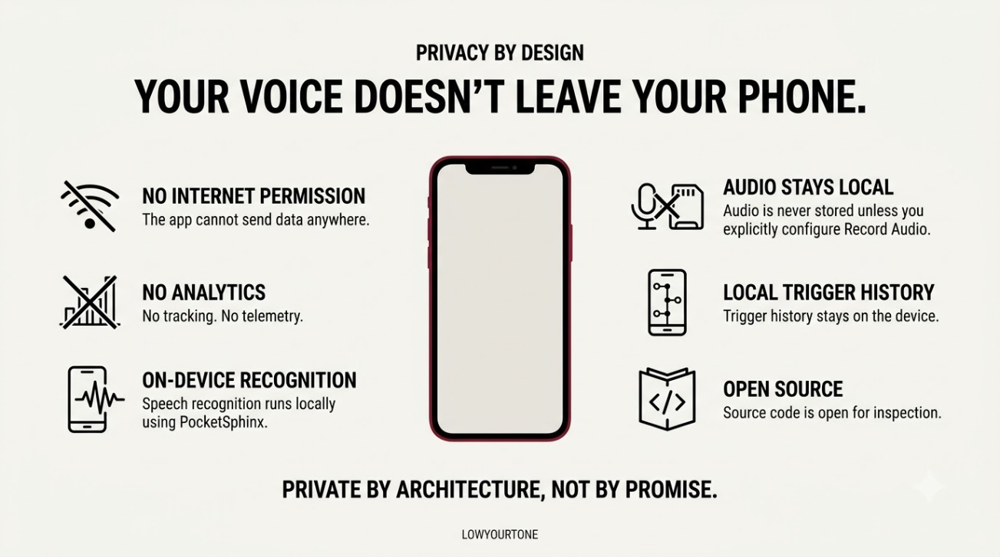

# LowYourTone

**Offline voice wake word automation for Android. Say a word, trigger an action. No internet required, no audio ever leaves your phone.**

  
  
  
  

---

  

  

  

  

  

  

  

  

---

## Download & Installation

[Download Latest APK](https://github.com/tech-anupam/LowYourTone/releases/latest)

> **Play Protect Notice**: Google Play Protect may flag the APK as unreviewed because it is downloaded directly from GitHub rather than Google Play. The app is completely safe, has zero internet permission, and the full source code is open for inspection.
>
> 1. Download the APK from the latest release.
> 2. Tap the downloaded file to install.
> 3. If prompted by Play Protect, tap **More details** and then **Install anyway**.

---

## Play Store?

Publishing on the Google Play Store costs **2,500 rupees** as a one-time developer registration fee. If this app is useful to you or you think it should reach more people:

**UPI: `anupambuilds@fam`**

Every rupee goes directly toward the Play Store listing. If we hit the goal, the app goes live on the Play Store - free, forever, for everyone.

---

## Built with

| Part | Technology |
|---|---|
| App | Kotlin, Jetpack Compose, Material 3 |
| Offline listener | PocketSphinx |
| Architecture | MVVM, Hilt, Room, DataStore |
| Location | Google Play Services Fused Location |
| Android range | min SDK 26, target SDK 36 |

---

## License

Open source under the [MIT License](LICENSE).

---

Built in India. For India. By someone who got tired of just being angry.

<a href="https://github.com/tech-anupam">@tech-anupam</a>

